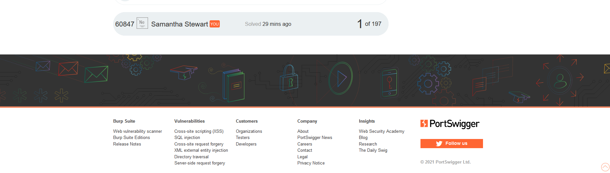

# Username-Enumeration-via-Different-responses-Brute-Force-Attacks-
Hacking a website portal (with permission) to identify vulnerable accounts with predictable usernames and passwords

Some users create website accounts with predictable usernames and passwords which makes them vulnerale to cyberattacks. In an attempt to notify PortSwigger of its Academy users with such vulnerabailities, I utilized Burp and FoxyProxy extension to FireFox to execute an attack on the Academy Portal. 

#Hall of Fame 

 
 
#The Process

[-] created an account with PortSwigger Blog Community

[-] attempted to log into the Web Security Academy using a random username and password

[-] sent the login request from Burp Browsing History to Burp Intruder

[-] ran an attack to locate a registered user

[-] ran a second request attack to identify the password for the registered user

[-] used the combined data to log into the user's account

https://github.com/samanthastewart19/Username-Enumeration-via-Different-responses-Brute-Force-Attacks-/blob/main/image.png

#Lesson Learnt

[-] never use common usernames or passwords online

[-] adding custom proxy to your website can help with tracking 

[-] change passwords regularly

[-] clear browsing cookies as often as possible

